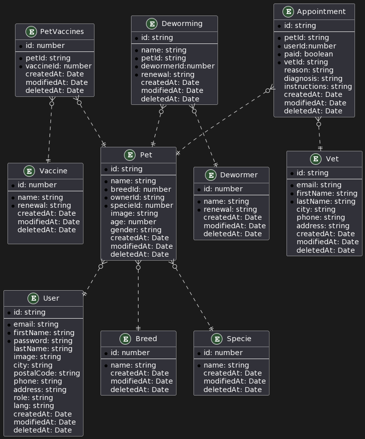

# Bley API

Bley API is a TypeScript-based REST API that utilizes TypeORM, Swagger and Zod. This API offers functionality to manage users, pets, breeds, species, vaccines, dewormers, vets, and appointments. Users can have administrator and user roles, granting them different permissions within the platform.

## Requirements

To run Bley API on your local environment, ensure that you have the following components installed:

- Node.js > 18
- Yarn
- Docker

## Installation

Follow these steps to install and run Bley API on your machine:

1. Clone this repository using `git clone`

```bash
 git@github.com:tamaraantonella/bley-api.git
```

2. Install dependencies

```bash
yarn
```

3. Configure environment variables. Create a .env file at the root of the project and provide the necessary values, such as database configuration and credentials.
4. Run the database container

```bash
yarn test:db:up
```

5. Start the application

```bash
yarn start
```

## Entity Diagram

Below is the entity diagram that represents the database structure used by Bley API:



## Usage
You can use Bley API to perform various operations related to users, pets, breeds, species, vaccines, dewormers, vets, and appointments.

## Contribution
If you wish to contribute to this project, feel free to fork it and submit pull requests.

